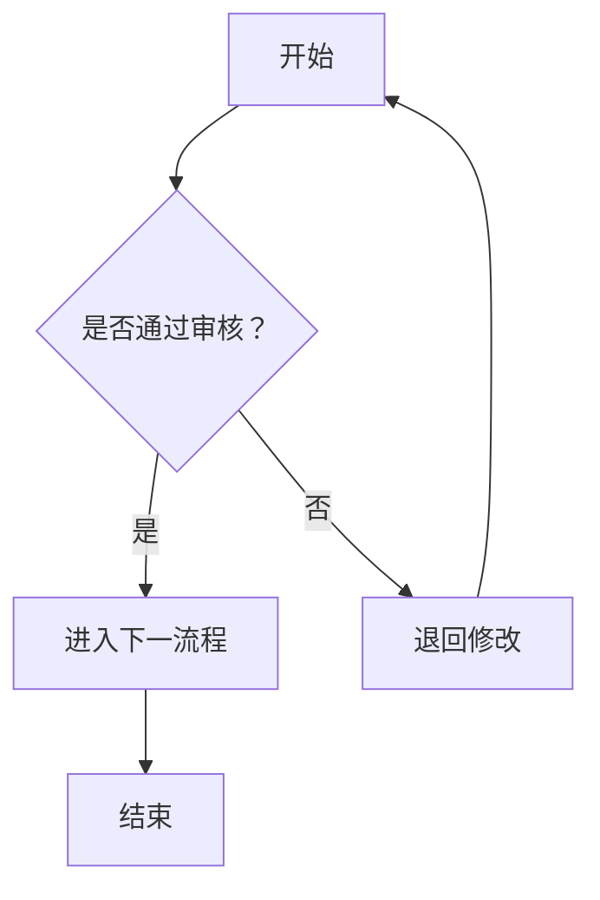

# 15. string的实现

1. 第一个函数：Insert 插入n个字符
2. string中的insert是在pos位置插入，不是pos后一个
3. 第二个函数：swap实现
4. 全局函数与模版函数同名，优先全局
5. 字符串匹配 strstr
6. 第三个函数：find
7. 第四个函数：substr
8. 第五个：流插入和提取，忽略空格换行
   - clear
   - getline
9. 现代写法
10. 

